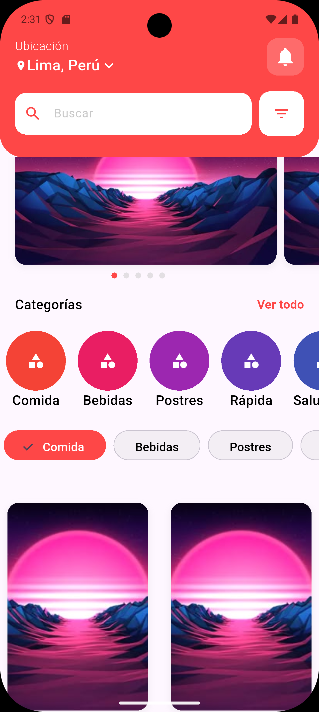

# 🧩 Hola Mundo - Flutter Widget Tree Demo

Una aplicación de demostración desarrollada con Flutter que ilustra las mejores prácticas para crear **árboles de widgets reutilizables** y arquitectura modular. Este proyecto sirve como ejemplo educativo para entender cómo estructurar componentes Flutter de manera eficiente.



## 🎯 Objetivo del Proyecto

Este proyecto es una **maqueta educativa** diseñada para:

- � **Enseñar** la estructura de árboles de widgets en Flutter
- 🧩 **Demostrar** cómo crear widgets reutilizables
- 🏗️ **Mostrar** patrones de arquitectura modular
- 💡 **Inspirar** buenas prácticas de desarrollo
- 🔧 **Servir** como plantilla base para otros proyectos

## ✨ Características de la Demo

- 🎨 **UI Moderna**: Interfaz atractiva para demostrar capacidades
- 🧩 **Widgets Modulares**: Cada componente es independiente y reutilizable
- 📱 **Responsive Design**: Adaptable a diferentes tamaños de pantalla
- 🔄 **Estado Dinámico**: Ejemplos de manejo de estado en widgets
- � **Casos de Uso Reales**: Componentes que se usan frecuentemente en apps

## 🏗️ Arquitectura

El proyecto sigue una arquitectura modular con widgets reutilizables:

```
lib/
├── src/
│   ├── pages/
│   │   └── home_page.dart          # Página principal
│   ├── widgets/
│   │   ├── header_widget.dart      # Encabezado con búsqueda
│   │   ├── section_title_widget.dart    # Títulos de sección
│   │   ├── special_carousel_widget.dart # Carrusel especial
│   │   ├── circular_categories_widget.dart # Categorías circulares
│   │   ├── category_chips_widget.dart   # Chips seleccionables
│   │   ├── product_grid_widget.dart     # Grid de productos
│   │   └── widgets.dart            # Exportaciones
│   └── utils/
│       └── app_colors.dart         # Colores del tema
└── main.dart                       # Punto de entrada
```

## � Lo que Aprenderás

### 1. **Estructura de Widgets**
- Cómo organizar widgets en un árbol jerárquico
- Separación de responsabilidades por componente
- Composición vs herencia en Flutter

### 2. **Reutilización de Componentes**
- Creación de widgets parametrizables
- Paso de callbacks y funciones
- Manejo de estado local y global

### 3. **Arquitectura Modular**
- Organización de carpetas y archivos
- Exportación e importación de widgets
- Patrones de diseño en Flutter

### 4. **Buenas Prácticas**
- Uso de `const` constructors para optimización
- Naming conventions para widgets personalizados
- Documentación de componentes

## 🧱 Componentes del Árbol de Widgets

Este proyecto demuestra cómo construir una aplicación compleja usando widgets pequeños y focalizados:

```
HomePage (Scaffold)
├── HeaderWidget (Container)
│   ├── LocationInfo (Column)
│   ├── NotificationButton (IconButton)
│   └── SearchBar (Row)
│       ├── TextFormField
│       └── FilterButton
├── ScrollableContent (SingleChildScrollView)
│   ├── SectionTitleWidget (Row)
│   ├── SpecialCarouselWidget (ListView.builder)
│   │   └── CarouselItem (Container + PageIndicator)
│   ├── CircularCategoriesWidget (ListView.builder)
│   │   └── CategoryItem (Column + CircleAvatar)
│   ├── CategoryChipsWidget (ListView.builder)
│   │   └── ChoiceChip (Stateful)
│   └── ProductGridWidget (GridView.builder)
│       └── ProductCard (Container)
```

## 🎯 Casos de Uso para Esta Estructura

Esta maqueta puede adaptarse fácilmente para:

- **📱 Apps de E-commerce**: Catálogos de productos
- **🍕 Apps de Delivery**: Menús y categorías
- **📰 Apps de Noticias**: Secciones y artículos
- **🎵 Apps de Música**: Playlists y géneros
- **📚 Apps Educativas**: Cursos y lecciones
- **🏪 Apps de Servicios**: Categorías de servicios

## 🎨 Widgets de Ejemplo

### HeaderWidget
Encabezado principal con ubicación, búsqueda y notificaciones:
```dart
HeaderWidget(
  location: "Lima, Perú",
  onNotificationPressed: () => handleNotifications(),
  onFilterPressed: () => showFilters(),
)
```

### SectionTitleWidget
Títulos de sección con acciones personalizables:
```dart
SectionTitleWidget(
  title: "Especial",
  actionText: "Ver todo",
  onActionPressed: () => navigateToSpecials(),
)
```

### SpecialCarouselWidget
Carrusel horizontal para productos destacados:
```dart
SpecialCarouselWidget(
  itemCount: 5,
  imageAsset: "assets/image.jpg",
)
```

### CircularCategoriesWidget
Lista horizontal de categorías con iconos circulares:
```dart
CircularCategoriesWidget(
  categories: ["Comida", "Bebidas", "Postres"],
  icon: Icons.category,
)
```

### CategoryChipsWidget
Chips seleccionables con estado interno:
```dart
CategoryChipsWidget(
  categories: categories,
  selectedIndex: 0,
  onCategorySelected: (index) => filterByCategory(index),
)
```

### ProductGridWidget
Grid responsivo para mostrar productos:
```dart
ProductGridWidget(
  itemCount: 6,
  crossAxisCount: 2,
  childAspectRatio: 3/4,
)
```

## 🚀 Cómo Usar Esta Maqueta

### Para Aprender
1. **Estudia cada widget** individualmente
2. **Observa** cómo se componen entre sí
3. **Experimenta** modificando parámetros
4. **Crea** tus propias variaciones

### Para Proyectos Reales
1. **Copia** los widgets que necesites
2. **Adapta** los parámetros a tu caso de uso
3. **Personaliza** colores y estilos
4. **Extiende** con nueva funcionalidad

### Instalación y Configuración

### Prerrequisitos
- Flutter SDK (≥ 3.35.1)
- Dart SDK (≥ 3.0.0)
- Android Studio / VS Code
- Git

### Pasos de instalación

1. **Clonar el repositorio**
```bash
git clone https://github.com/GianSandoval5/hola_mundo.git
cd hola_mundo
```

2. **Instalar dependencias**
```bash
flutter pub get
```

3. **Ejecutar la aplicación**
```bash
flutter run
```

## 📱 Plataformas Soportadas

- ✅ Android
- ✅ iOS
- ✅ Web
- ✅ Windows
- ✅ macOS
- ✅ Linux

## 🎯 Casos de Uso

- **Aplicaciones de Delivery**: Base perfecta para apps de entrega de comida
- **E-commerce**: Estructura adaptable para tiendas online
- **Catálogos**: Sistema de categorías y productos
- **Apps de Servicios**: Framework para aplicaciones de servicios locales

## 🔧 Personalización y Experimentación

### Colores del Tema

### Colores del Tema
Modifica `lib/src/utils/app_colors.dart`:
```dart
class AppColors {
  static const Color primary = Color(0xFF2196F3);
  static const Color grey = Color(0xFF9E9E9E);
  static const Color white = Color(0xFFFFFFFF);
}
```

### Experimentar con Widgets
```dart
// Prueba diferentes configuraciones
SpecialCarouselWidget(
  itemCount: 3,        // Cambia la cantidad
  imageAsset: "tu_imagen.jpg",  // Usa tus imágenes
)

// Modifica comportamientos
CategoryChipsWidget(
  categories: tusCategorias,
  selectedIndex: 2,    // Cambia el seleccionado inicial
  onCategorySelected: tuFuncion,  // Agrega tu lógica
)
```

## 💡 Tips para Desarrolladores

### 🎯 **Para Principiantes**
- Comienza modificando colores y textos
- Observa cómo cambia la UI al modificar parámetros
- Practica creando widgets similares desde cero

### 🚀 **Para Intermedios**
- Estudia la gestión de estado en `CategoryChipsWidget`
- Implementa navegación entre pantallas
- Agrega animaciones a los widgets

### 🔥 **Para Avanzados**
- Implementa arquitectura BLoC o Provider
- Agrega tests unitarios a los widgets
- Optimiza el rendimiento con keys y builders

## 📚 Recursos de Aprendizaje

- **Flutter Widget Catalog**: Explora todos los widgets disponibles
- **Flutter Layout Cheat Sheet**: Guía visual de layouts
- **Dart Language Tour**: Fundamentos del lenguaje
- **Flutter Architecture Samples**: Patrones de arquitectura

## 📊 Rendimiento

- ⚡ Renderizado optimizado con widgets const
- 🎯 ListView.builder para listas eficientes
- 🔄 Gestión inteligente del estado
- 📱 UI responsive y adaptativa

## 🤝 Contribuciones

¡Las contribuciones son bienvenidas! Por favor:

1. Fork el proyecto
2. Crea una rama para tu feature (`git checkout -b feature/AmazingFeature`)
3. Commit tus cambios (`git commit -m 'Add some AmazingFeature'`)
4. Push a la rama (`git push origin feature/AmazingFeature`)
5. Abre un Pull Request

## 📝 Licencia

Este proyecto está bajo la Licencia MIT. Ver `LICENSE` para más detalles.

## 👨‍💻 Autor

**Gian Sandoval**
- GitHub: [@GianSandoval5](https://github.com/GianSandoval5)
- Proyecto educativo para la comunidad Flutter

## 🙏 Agradecimientos

- Flutter Team por el increíble framework
- Comunidad de Flutter por compartir conocimiento
- Desarrolladores que contribuyen con ejemplos y tutoriales

---

⭐ ¡Dale una estrella si este ejemplo te ayudó a entender Flutter mejor!
🔄 ¡Haz fork del proyecto para crear tus propias variaciones!
